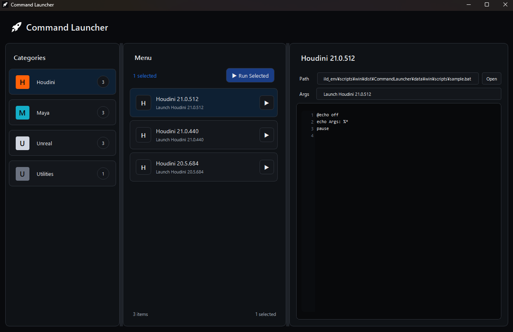
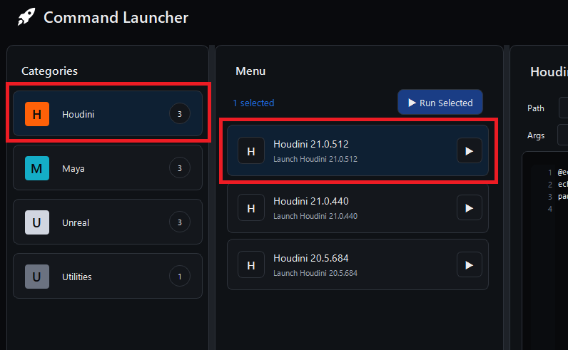
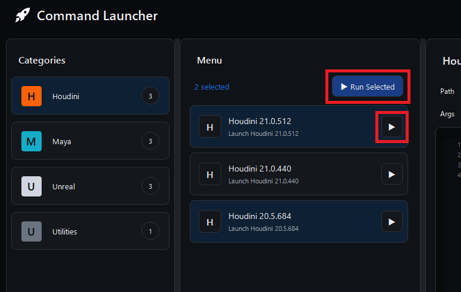
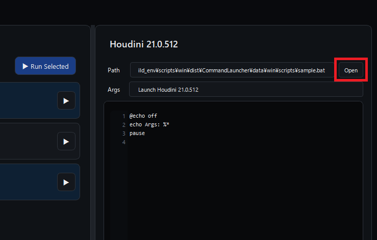

# Command Launcher

バッチファイル・シェルスクリプトなどを登録して実行できる汎用ランチャーツールです。  
カテゴリ分けや引数設定が行えるため、DCCツールの複数環境の切り替え処理などに活用できます。



## 動作環境

Windows環境およびmacOS環境で使用できます。

- 動作確認済のOSバージョン
  - Windows 11
  - macOS 15.3.2

## 対応スクリプト形式

| 拡張子     | Windows | macOS |
| ---------- | ------- | ----- |
| `.bat`     | ✓       | —     |
| `.ps1`     | ✓       | —     |
| `.exe`     | ✓       | —     |
| `.sh`      | —       | ✓     |
| `.command` | —       | ✓     |
| `.app`     | —       | ✓     |

---

## セットアップ

本ツールはパッケージ配布は行っていないため、ソースコードから直接起動するか、手元でビルドしてご使用ください。</br>
セットアップ手順は以下になります。

### 1. リポジトリのクローン

```
git clone <repository_url>
cd pyside-command-launcher
```

### 2. 環境構築

仮想環境の作成と依存パッケージのインストールを行います。

```bat
# Windows
scripts\win\Setup.bat

# macOS
bash scripts/mac/Setup.sh
```

セットアップスクリプトは以下を自動実行します。

- **Windows:** NuGet 経由で Python を `bin/` へダウンロードし、`.venv` を作成
- **macOS:** システムの Python を使用して `.venv` を作成

### 3. ツール起動

```bat
# Windows
scripts\win\LaunchApp.bat

# macOS
bash scripts/mac/LaunchApp.sh
```

デフォルトでは `data/<os>/ItemData.json` を読み込みます。別のJSONを指定したい場合は `--json-path` 引数で渡します。

```
python -m cmdlaunch.main --json-path path/to/ItemData.json
```

また、`LaunchApp_Dev`スクリプトでは、確認用に`ItemData_Dev.json`という名称のJSONファイルを指定するようにしてあります。

---

## ツールの使い方

### 基本操作

**1. 左サイドバーでカテゴリを選択し、中央パネルからコマンドを選択します。**

- Shift、Ctrlキーで複数選択も可能です。</br>選択すると、右パネルにスクリプト情報の詳細が表示されます。

  

  | 操作                    | 動作              |
  | ----------------------- | ----------------- |
  | 左クリック              | 単体選択          |
  | Shift + 左クリック      | 範囲選択          |
  | Ctrl (Cmd) + 左クリック | 個別に追加 / 解除 |

**2. 各ボタンからコマンドを実行します。**

- 各行のボタンの他、上部ボタンから複数コマンドの一括実行が行えます。

  

  | 操作                  | 動作                           |
  | --------------------- | ------------------------------ |
  | コマンド行の ▶ ボタン | そのコマンドを単体で即時実行   |
  | ▶ Run Selected ボタン | 選択中のコマンドをまとめて実行 |

**3. （任意）右パネルの Open ボタンからスクリプトファイルの場所を開くことができます。**



---

## 設定ファイルのカスタマイズ

表示するカテゴリやコマンドは JSON ファイルを編集することで自由にカスタマイズできます。  
起動時に読み込まれ、ランチャーに表示するカテゴリとコマンドを定義します。

- Windows: `data/win/ItemData.json`
- macOS: `data/mac/ItemData.json`

### JSON スキーマ定義

```json
{
  "Categories": [
    {
      "Name": "カテゴリ名",
      "IconColor": "#ff6108",
      "IconPath": "",
      "Items": [
        {
          "Name": "コマンド名",
          "IconColor": "",
          "IconPath": "",
          "Description": "説明文",
          "ScriptPath": "{APP_ROOT_DIR}/data/win/scripts/sample.bat",
          "Args": "引数1 引数2"
        }
      ]
    }
  ]
}
```

**Categories（カテゴリ設定）**

| フィールド  | 説明                               |
| ----------- | ---------------------------------- |
| `Name`      | カテゴリ名                         |
| `IconColor` | アイコンの色（16進数カラーコード） |
| `IconPath`  | アイコン画像のパス                 |
| `Items`     | コマンド設定の配列                 |

**Items（コマンド設定）**

| フィールド    | 説明                               |
| ------------- | ---------------------------------- |
| `Name`        | コマンド名                         |
| `Description` | コマンドの説明文                   |
| `ScriptPath`  | 実行するスクリプトのパス           |
| `Args`        | スクリプトに渡す引数               |
| `IconColor`   | アイコンの色（16進数カラーコード） |
| `IconPath`    | アイコン画像のパス                 |

### パスのプレースホルダー

`ScriptPath` および `IconPath` には以下のプレースホルダーが使用できます。

| プレースホルダー | 展開先                               |
| ---------------- | ------------------------------------ |
| `{APP_ROOT_DIR}` | アプリケーションのルートディレクトリ |

---

## ビルド（スタンドアロン実行ファイルの生成）

PyInstaller を使用してスタンドアロン実行ファイル（`.exe` / `.app`）を生成できます。  
ビルド環境は `build_env/` 以下に独立しており、実行環境とは別の仮想環境を使用します。

### ビルド環境のセットアップ（初回のみ）

```bat
# Windows
build_env\scripts\win\Setup.bat

# macOS
bash build_env/scripts/mac/Setup.sh
```

### ビルド実行

```bat
# Windows
build_env\scripts\win\BuildApp.bat

# macOS
bash build_env/scripts/mac/BuildApp.sh
```

ビルド成果物は `build_env/scripts/<os>/dist/CommandLauncher/` に出力されます。

---

## アーキテクチャ概要

MVC パターンを採用しており、`MainController` が `MainModel` と `MainView` を仲介します。  
Widget は Model を直接参照せず、Qt シグナルを通じてイベントを通知します。

```
python/cmdlaunch/
├── main.py                 # QApplication の初期化・エントリーポイント
├── tool_config.py          # アプリ設定
├── definitions.py          # CommandType / PlatformType などの列挙型
├── logger.py               # ロガー設定
├── data/
│   ├── item_info.py        # CategoryItemInfo / CommandItemInfo データクラス
│   └── interface.py        # データクラス用インターフェース
└── gui/
    ├── main_model.py        # Model層: JSON 読み込み・コマンド実行など
    ├── main_view.py         # View層: 3ペイン構成で各widgetsを組み合わせて構成
    ├── main_controller.py   # Controller層: Model、Viewの受け渡し
    └── widgets/
        ├── category_panel.py  # 左サイドバー: カテゴリ一覧
        ├── category_item.py   # カテゴリアイテム
        ├── menu_panel.py      # 中央パネル: コマンド一覧
        ├── menu_item.py       # コマンドアイテム
        ├── detail_panel.py    # 右パネル: スクリプトプレビュー
        └── icon_button.py     # アイコンボタン
```
